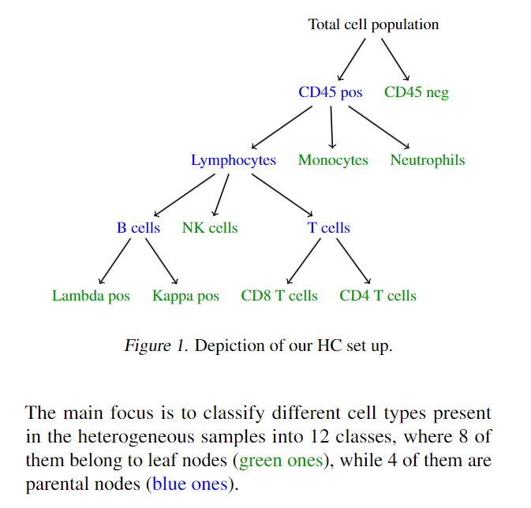

# FCHC-GNN: Hierarchical Graph Neural Networks for Flow Cytometry Prediction
This repository contains the official implementation of our paper titled "Injecting Hierarchical Biological Priors into Graph Neural Networks for Flow Cytometry Prediction" currently under peer-review for the ICML 2024 Workshop on Accessible and Efficient Foundation Models for Biological Discovery.

## Overview
Flow cytometry (FC) is a powerful technology that enables rapid multi-parametric analysis of single cells in solution. However, the complex hierarchical relationships and neighborhood interactions inherent in cellular processes pose significant challenges for traditional flat data representations. Our work proposes a novel hierarchical Graph Neural Network (GNN) framework, termed FCHC-GNN, that injects structured biological priors to enhance multi-class prediction on FC cellular data.

As shown in the diagramm below, by encoding known hierarchical (HC) relationships between cell types and functional classes, our model effectively captures the rich dependencies innate to biological domains while operating on a tabular input representation. Extensive experiments across our real-world FC dataset demonstrate substantially improved performance over strong baselines that fail to leverage such hierarchical constraints.

 

## Highlights

- **Novel Hierarchical GNN Framework:** We introduce FCHC-GNN, a novel approach to inject structured biological priors into GNN models for multi-class prediction on tabular cellular data.
- **Hierarchical Constraint Injection:** Our model encodes the known hierarchical relationships between cell types and functional classes, serving as an inductive bias that encourages the GNN to respect the hierarchical dependencies inherent to the biological domain.
- **Custom Hierarchical Loss Function:** We employ a custom hierarchical loss function that accounts for the hierarchical similarities between classes, in addition to the traditional cross-entropy loss.
- **Improved Performance:** Extensive experiments on our real-world FC dataset demonstrate significant performance gains over strong baselines that do not leverage hierarchical constraints.
- **Generalizability:** We validate the generality of our FCHC-GNN module by conducting experiments on public datasets like ImageNet, showcasing its broad applicability to domains with hierarchical class structures.


_Figure 1_: Patient 7 has been randomly picked for visualization purposes, and the embeddings of cell populations of medical interest have been plotted. The [t-SNE](https://www.jmlr.org/papers/volume9/vandermaaten08a/vandermaaten08a.pdf?fbcl) plot illustrates the effectiveness of our FCHC-GNN module in capturing the hierarchical relationships among different cell types, clearly separating the clusters according to their functional classes. 

## Getting Started

To get started with our FCHC-GNN implementation, please follow the instructions in the Installation and Usage sections.

### Installation

Clone the repository:
```
git clone https://github.com/LorenzoBini4/FCHC-GNN-Hierarchical.git
cd FCHC-GNN-Hierarchical
```

Set-up conda `environment.yaml` file:
```bash
conda env create -f environment.yaml
conda activate fchc-gnn
```

Alternatively, install the requirements:
```
pip install -r requirements.txt
```

### Usage
To train, validate, and test the FCHC-GNN model on the deep hierarchy experiments, run the following command where we rely on Slurm job scheduling system:
```
bash deep-hc.sh 
```

While for training, validation, and testing of the FCHC-GNN model on the shallow hierarchy ablation experiments, run the following command:
```
bash shallow-hc.sh 
```

### Visualization
- `visualization/viz.py`: Visualization script to reproduce the t-SNE embedding, plot the feature importance, the degrees visualization and the attention explainer for `best/best_FCHC-GAT.pt` plug-in module.

## Citation & Contributing 
If you find our work useful in your research, please consider citing our paper:
```
@misc{icml2024@AccMLBio,
    title={Injecting Hierarchical Biological Priors into Graph Neural Networks for Flow Cytometry Prediction},
    author={Fatemeh Nassajian Mojarrad and Lorenzo Bini and Thomas Matthes and Stéphane Marchand-Maillet},
    year={2024},
    eprint={2405.18507},
    archivePrefix={arXiv},
    primaryClass={cs.LG}
}
```
We welcome contributions from the community! If you encounter any issues or have suggestions for improvements, please open an issue or submit a pull request. For more details on our works, please refer to our  [VIPER Webpage](https://viper-geneva.github.io/)!
